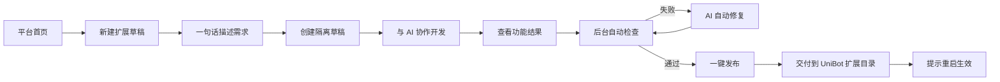
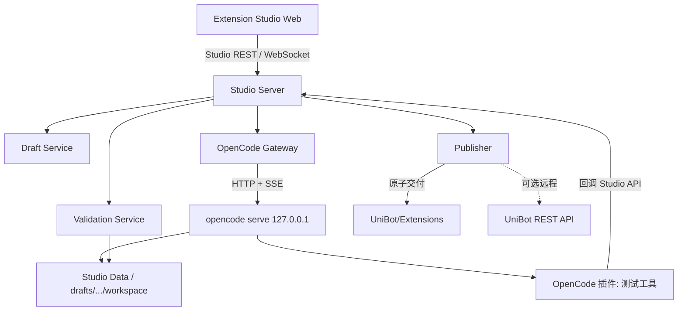

# UniBot Extension Studio 规划

> 状态：第一版核心闭环已实施（创建 → 生成 → 校验 → 一键发布），见 `Studio/` 目录  
> 日期：2026-08-13（实施：2026-08-14）  
> 基础能力：[OpenCode](https://github.com/anomalyco/opencode) Server API  
> 前端编码规范：合并自 `Studio/Frontend.md`，见「九·五、前端编码规范」

## 一、定位

**Extension Studio** 是一个独立于 UniBot WebUI 的 AI 扩展开发平台，本质是 OpenCode Server 的特定化封装：把通用 AI 编程能力定制为「开发 UniBot 原生扩展」这一垂直场景，让不会写代码的用户用自然语言创建、检查并发布扩展。

平台独立部署、独立前后端，不嵌入 WebUi；通过约定的发布接口把扩展交付给 UniBot。目标用户仍然是不需要理解代码与 Diff 的普通用户。

第一版目标：

- 从空白模板创建一个目录型代码扩展，支持 `api`、`command` 类型
- 用一句话描述需求，实时看到 AI 正在做什么和最终能提供什么功能
- 自动在隔离目录执行清单校验、语法检查、Ruff 和扩展专项测试
- 检查失败时优先由 AI 自动修复，必要时用通俗问题向用户补充提问
- 检查通过后由用户点击“一键发布”，系统原子交付到 UniBot `Extensions/<id>/`
- 保存草稿和会话，刷新页面后可以继续开发

第一版不做：

- 不生成 NoneBot 插件、渲染器、模板或资源包
- 不允许 AI 修改 UniBot 核心代码、配置、用户数据或已有扩展
- 不直接提交 Git、不创建 GitHub 仓库、不自动发布扩展市场
- 不提供多人同时编辑同一草稿
- 不在浏览器中保存模型 API Key 或 OpenCode Server 密码
- 不承诺进程级沙箱；AI 生成并安装的扩展仍是与 UniBot 同进程运行的可信代码
- 不内嵌进 WebUi；平台独立部署，通过发布接口把扩展交付给 UniBot
- 不内置 MC 测试服务器环境（见“备用方案：MC 测试环境”）

## 二、核心原则

1. **草稿与运行目录隔离**：AI 只能操作平台数据目录下的草稿工作区，不能直接写 UniBot `Extensions/`；发布是唯一交付通道。
2. **后端是唯一可信边界**：浏览器不直连 OpenCode，不接触其密码，也不能提交任意工作目录。
3. **结果导向**：用户只需要理解功能摘要、使用方式和检查结果；路径检查、依赖检查和测试由后台自动完成。
4. **权限默认拒绝**：OpenCode 的文件写入仅允许草稿目录；shell、网络访问和目录外路径必须拒绝或人工确认。
5. **可恢复**：草稿元数据、OpenCode 会话 ID、校验结果与发布记录落盘，页面刷新不丢失进度。
6. **契约优先**：系统提示词引用 UniBot 扩展开发规范和示例，并以与 UniBot 兼容的校验流水线为最终标准。
7. **配置驱动、便于增删功能**：提示词、工具、Agent、校验步骤和功能模块全部走注册表 + 配置文件，新增/停用功能不需要改核心代码。

## 三、用户流程



### 3.1 创建草稿

平台首页默认展示草稿列表和“新建扩展”按钮。平台自带管理员认证，首次启动时设置本地访问口令；也可配置复用已有管理员凭据。

新建表单字段：

| 字段 | 规则 |
| --- | --- |
| 扩展 ID | 必填，PascalCase；创建后不可修改；不得与现有扩展或草稿冲突 |
| 显示名称 | 必填 |
| 功能描述 | 必填，作为第一条需求上下文 |
| 扩展类型 | 多选，第一版仅 `api`、`command` |
| 模型 | 从 OpenCode `/config/providers` 返回的已连接模型中选择 |
| Agent | 默认 `build`；只展示后端允许的 Agent |

创建时由后端写入最小目录型脚手架：

```text
<studio_data>/drafts/<draft_id>/
├── draft.json                 # 草稿状态、所有者、session id、发布时间等
└── workspace/
    └── <ExtensionId>/
        ├── Extension.toml
        ├── __init__.py
        └── tests/
            └── test_extension.py
```

脚手架创建后，Studio Server 建立 OpenCode session，并通过 `noReply` 注入扩展规范、允许路径、校验命令和用户填写的概要，随后发送第一条实现请求。

### 3.2 AI 开发工作台

桌面端采用三栏工作区，不使用营销式卡片布局：

```text
┌──────────────┬─────────────────────────────┬──────────────────────────┐
│ 草稿 / 文件   │ 对话与工具执行               │ 结果与使用                │
│              │                             │                          │
│ 草稿状态      │ 消息时间线                   │ [功能] [设置] [检查]      │
│ 文件树        │ 权限请求                     │ 功能摘要 / 使用方式       │
│ 会话历史      │ 待办进度                     │ 检查状态                  │
│              │                             │                          │
│              │ 输入框 + 停止/发送            │ 一键发布                  │
└──────────────┴─────────────────────────────┴──────────────────────────┘
```

- 左栏宽度约 240px，可折叠；展示草稿状态、文件树和会话历史
- 中栏是主操作面，消息流按 `text`、`reasoning`、`tool`、`error` 分块渲染
- 右栏宽度约 42%，使用 `功能 / 设置 / 检查` Tabs，可折叠；源码、Diff 和日志收纳在“技术详情”中
- 输入框固定在中栏底部；生成中“发送”切换为带 `lucide:square` 的停止按钮
- 顶部工具栏展示 OpenCode 连接状态、当前模型、会话消耗与草稿状态
- 手机端改为单栏，使用 `对话 / 结果 / 设置` Tabs；底部保留输入区

视觉沿用 UniBot WebUi 的设计语言（白色层级背景、1px 边框、6–8px 圆角、蓝色主操作色），但作为独立应用自带设计变量，不依赖 WebUi 的样式文件。代码、diff 和终端输出使用等宽字体；新增成功、警告、删除三种 diff 背景变量。

### 3.3 对话与工具状态

消息时间线需要支持：

- 用户消息、AI 文本回复和思考摘要
- 文件读取、搜索、编辑、命令执行等工具调用
- 工具状态：等待、执行中、成功、失败
- OpenCode `question.asked` 的结构化提问
- OpenCode `permission.asked` 的授权条目
- 会话 `busy`、`idle`、`retry` 和错误状态
- 会话待办事项与完成状态

权限条目使用明确命令按钮：

- “仅允许本次”对应 `once`
- “本草稿始终允许”对应 `always`，但后端仍不得放宽目录边界
- “拒绝”对应 `reject`

涉及 shell 和网络访问时展示完整命令、目标地址与理由。页面不能自动点击允许，也不能只用一个含糊的“继续”按钮。

### 3.4 结果确认与一键发布

右栏默认展示功能摘要、使用方式、配置项和后台检查状态。源码、Diff 和日志不进入普通用户主流程，仅在“技术详情”中按需查看。

主操作按钮状态：

- 生成中：显示“停止生成”
- 需要用户补充信息：显示易懂的问题
- 检查中：显示当前检查项目
- 检查失败：显示“自动修复”，修复后重新检查
- 检查通过：显示“一键发布”

机械校验失败不是死胡同：自动校验失败会退回草稿并展示失败步骤，前端提供「让 AI 修复校验问题」（把失败步骤作为问题单喂给 AI，修完重跑校验）、「重新校验」（测试环境恢复/手动修复后的重跑入口）和「同步测试环境」（环境未就绪类失败——AI 无法修复基础设施问题）；校验通过时草稿进入 `ready`。

发布确认只列出功能摘要、使用方式、配置项和重启提示。技术细节可折叠查看。目标 ID 已存在时第一版拒绝覆盖；后续版本再设计已有扩展的备份与升级流程。

发布采用同一文件系统内的临时目录和原子重命名：重新校验路径与清单，将草稿复制到 UniBot `Extensions/.staging-<id>`，校验完整后重命名为 `Extensions/<id>`。失败时清理 staging，不改变正式目录。本地发布要求平台与 UniBot 同机；远程部署时改为调用 UniBot REST API 完成交付。发布成功后将草稿设为只读并提示重启生效。

### 3.5 AI 测试工具（OpenCode 插件）

不再设置独立的「审核 AI」。生成会话内的 AI 直接使用平台通过 OpenCode 插件注册的测试工具，在真实 UniBot 测试环境中对扩展做「部署 → 加载 → 验证 → 观察日志」的闭环，发现异常当场修复、重新加载验证，最后仍由机械校验流水线把关。

测试工具由 **OpenCode 插件**提供：插件源码放在 `server/plugins/`，随 Studio 打包部署，并在 OpenCode 启动时通过配置注册（见 5.1 的独立数据目录与 5.2 的路径路由）。每个工具即 `@opencode-ai/plugin` 的 `tool()` 定义，供生成会话的 AI 调用。

第一版工具清单：

| 工具 | 作用 | 主要参数 |
| --- | --- | --- |
| `unibot_test_status` | 查询测试环境（UniBot 源码 + venv）是否就绪、版本、路径 | — |
| `unibot_test_sync` | 拉取/更新测试环境到指定版本（幂等，原子替换） | `tag?` |
| `unibot_deploy` | 把草稿扩展复制到测试环境的 `Extensions/<id>/`（staging + 原子重命名） | `extension_id` |
| `unibot_undeploy` | 从测试环境移除已部署的扩展 | `extension_id` |
| `unibot_load` | 触发测试环境 UniBot 重新加载扩展并报告绑定结果 | `extension_id` |
| `unibot_logs` | 读取测试环境 UniBot 日志中与该扩展相关的最近记录 | `extension_id`、`lines?` |
| `unibot_run_tests` | 在测试环境运行草稿自带的 pytest 测试并返回结构化结果 | `extension_id`、`paths?` |
| `unibot_validate` | 运行与发布前一致的完整校验流水线（只读） | `extension_id` |

安全与边界：

- 所有工具只允许操作**测试环境**（`unibot_env.test_dir`，独立于正式 UniBot），默认权限为 `ask`，由后端按 5.2 的路径校验规则约束
- `unibot_deploy` 只写测试环境的 `Extensions/`，不触碰正式 `UniBot/Extensions/`；正式交付仍只走「一键发布」
- 子进程执行复用 8.2 的受限子进程约束（固定 cwd、清理环境变量、超时与输出上限）
- 测试环境被污染时可通过「同步测试环境」重建（见 3.4）

AI 用工具自测并确认通过后，会话空闲时系统自动运行机械校验（与 `unibot_validate` 一致的流水线），校验通过草稿进入 `ready` 可一键发布；校验失败回到 `confirming`，由 AI 读取失败步骤修复后重新校验。

## 四、状态模型

草稿状态：

```text
主链：draft -> generating -> checking -> ready -> published
分支：检查失败 -> repairing -> checking
```

`draft.json` 建议字段：

```json
{
  "schema_version": 1,
  "id": "uuid",
  "extension_id": "WeatherExt",
  "name": "天气扩展",
  "owner_id": "admin-user-id",
  "status": "checking",
  "session_id": "ses_xxx",
  "model": { "provider_id": "...", "model_id": "..." },
  "agent": "build",
  "created_at": "ISO-8601",
  "updated_at": "ISO-8601",
  "validation_revision": null,
  "published_at": null
}
```

`validation_revision` 不能只存时间。后端应对草稿内全部文件的相对路径与内容计算 SHA-256；仅当当前摘要与最近一次通过检查的摘要一致时，才允许执行一键发布。

## 五、平台架构



项目结构（仓库内与 `WebUi/`、`UniBot/` 平级的新目录）：

```text
ExtensionStudio/
├── server/                     # 后端：Node.js + TypeScript（OpenCode SDK 封装）
│   ├── package.json
│   └── src/
│       ├── index.ts            # Studio REST / WebSocket 路由与平台认证
│       ├── opencode.ts         # OpenCode 网关：进程、认证、SDK 调用、SSE
│       ├── studio.ts           # 会话编排、权限策略、事件归一化、结果翻译
│       ├── drafts.ts           # 草稿 CRUD、路径解析、文件摘要
│       ├── validation.ts       # 校验流水线编排（子进程调用 UniBot 校验脚本）
│       ├── publishing.ts       # 发布器：本地目录 / UniBot API
│       └── config.ts
├── plugins/                    # OpenCode 插件：AI 测试工具（部署/加载/日志/测试）
├── web/                        # 前端：独立 Vue 3 + Vite 应用
│   ├── package.json
│   └── src/                    # 编码规范见九·五节，独立实现
├── Install.sh                  # 一键安装脚本
└── README.md
```

平台数据目录默认 `~/.unibot-studio/`：`drafts/`、`opencode/`（独立配置与凭据）、`logs/`。

### 5.1 OpenCode 部署方式

由 Studio Server 管理一个本机 `opencode serve` 子进程：

- 仅监听 `127.0.0.1`，不开放局域网访问
- 使用随机空闲端口，不依赖固定 `4096`
- 启动时生成高熵 `OPENCODE_SERVER_PASSWORD`，仅保存在后端进程内存
- 设置独立的 OpenCode 数据目录，避免与管理员个人 OpenCode 会话混用
- 启动后轮询 `/global/health`，记录版本；退出时终止子进程
- 进程异常退出后做有限次数退避重启，并把“服务不可用”推送到页面
- 固定并记录经过验证的 OpenCode 版本；健康检查发现不兼容版本时禁用工坊
- 启动前注入 LLM 超时配置（provider `options.timeout` / `options.chunkTimeout`），
  思考模型长时间无输出时不被默认的 30s chunk 超时提前掐断（见 5.1.1）

后端统一使用 JavaScript 生态：通过官方 `@opencode-ai/sdk`（TypeScript 类型安全客户端）连接 OpenCode，直接复用 SDK 的 Session / Message / Part / Permission / Event 类型与 SSE 事件流，不自己维护 HTTP 客户端。运行时默认 Bun（与 WebUi、FakePlayer 一致），SDK 以 npm 包形式安装。OpenCode API 演进时，以固定版本的 `/doc` OpenAPI 3.1 规范快照跑契约测试兜底。

### 5.2 工作目录路由

每次请求 OpenCode 时，Gateway 根据后端保存的 `draft_id` 解析真实路径，并设置 `x-opencode-directory`。前端永远不提交绝对路径，也不能覆盖该 header。

所有路径在使用前执行：

1. `resolve()` 获取规范路径
2. 校验路径位于目标草稿 `workspace` 内
3. 拒绝符号链接、`..`、绝对路径和大小写冲突
4. 发布时再次逐文件检查，避免生成过程中插入越界链接

### 5.3 事件转发

Studio Server 维护一条到 OpenCode `/event` 的 SSE 连接，按 `sessionID` 过滤并转换成平台自有事件结构，再通过专用的已认证 WebSocket `/api/studio/events` 推送给前端。

不能把 OpenCode 原始事件直接透传为前端长期契约。转换层至少规范化：

- `session.status`
- `session.diff`
- `message.updated` / `message.part.updated` / 增量文本事件
- `permission.asked` / `permission.replied`
- `question.asked` / `question.replied`
- `todo.updated`
- `session.error`

断线重连后，前端先通过 REST 重新获取 session、messages、todo、diff 和待处理授权，再继续消费实时事件，避免只靠事件流恢复状态。

## 六、后端 API 草案

所有接口要求管理员权限；错误继续使用 UniBot 的 `{ code, data, message }` 包装。

| 方法 | 路径 | 用途 |
| --- | --- | --- |
| `GET` | `/api/studio/status` | OpenCode 健康状态、版本和可用性 |
| `GET` | `/api/studio/options` | 已连接模型和允许的 Agents |
| `GET` | `/api/studio/drafts` | 草稿列表 |
| `POST` | `/api/studio/drafts` | 创建草稿、脚手架和 session |
| `GET` | `/api/studio/drafts/{id}` | 草稿、会话状态和校验摘要 |
| `DELETE` | `/api/studio/drafts/{id}` | 删除未发布草稿及对应 session |
| `GET` | `/api/studio/drafts/{id}/messages` | 获取历史消息和 parts |
| `POST` | `/api/studio/drafts/{id}/messages` | 异步发送 prompt |
| `POST` | `/api/studio/drafts/{id}/abort` | 停止当前生成 |
| `GET` | `/api/studio/drafts/{id}/files` | 草稿文件树 |
| `GET` | `/api/studio/drafts/{id}/files/content` | 读取受限路径的文件内容 |
| `GET` | `/api/studio/drafts/{id}/diff` | 获取会话 diff |
| `GET` | `/api/studio/drafts/{id}/todo` | 获取会话待办 |
| `POST` | `/api/studio/drafts/{id}/permissions/{permission_id}` | 回复权限请求 |
| `POST` | `/api/studio/drafts/{id}/questions/{question_id}` | 回复结构化问题 |
| `POST` | `/api/studio/drafts/{id}/validate` | 启动校验流水线 |
| `POST` | `/api/studio/drafts/{id}/publish` | 校验摘要并原子发布 |
| `GET` | `/api/studio/settings` | 平台配置：功能开关、默认模型、Agent 配置 |
| `PATCH` | `/api/studio/settings` | 更新平台配置（校验后写入配置文件） |
| `GET` | `/api/studio/tools` | 工具注册表：启停、权限、适用阶段 |
| `PATCH` | `/api/studio/tools` | 更新工具开关与权限 |
| `GET` | `/api/studio/prompts` | 提示词模板列表与当前版本 |
| `GET` | `/api/studio/prompts/{name}` | 获取提示词模板内容 |
| `POST` | `/api/studio/prompts/{name}` | 保存新版本并预览 |
| `POST` | `/api/studio/prompts/{name}/activate` | 启用指定提示词版本（可回滚） |
| `GET` | `/api/studio/validation/steps` | 校验流水线步骤配置（启停、排序） |
| `PATCH` | `/api/studio/validation/steps` | 更新校验步骤编排 |
| `WS` | `/api/studio/events` | 当前管理员可访问草稿的实时事件 |

后端到 OpenCode 的主要映射：

| 工坊能力 | OpenCode API |
| --- | --- |
| 健康检查 | `GET /global/health` |
| 模型列表 | `GET /config/providers`、`GET /provider` |
| Agent 列表 | `GET /agent` |
| 创建/恢复会话 | `POST /session`、`GET /session/:id` |
| 异步发送需求 | `POST /session/:id/prompt_async` |
| 消息恢复 | `GET /session/:id/message` |
| 停止生成 | `POST /session/:id/abort` |
| 技术详情 | `GET /session/:id/diff` |
| 文件浏览 | `GET /file`、`GET /file/content` |
| 任务进度 | `GET /session/:id/todo` |
| 权限应答 | `POST /session/:id/permissions/:permissionID` |
| 实时更新 | `GET /event` SSE |

OpenCode API 在迭代中可能改名；实施时以固定版本的 `/doc` OpenAPI 3.1 规范为准，不把本文中的路径视为跨版本永久契约。

## 七、提示词、工具与可配置性

### 7.1 提示词模板化

系统提示词按场景拆成独立模板文件，放入 `server/prompts/` 目录（`.md` + 前置 front-matter）：

```text
server/prompts/
├── system.md          # 基础角色与总原则
├── scaffold.md        # 生成阶段：扩展规范 + 需求 + 白名单
├── summary.md         # 结果翻译：功能摘要与使用方式
└── messages/          # 面向小白的文案（可编辑）
```

- 模板内使用占位符（如 `{{extension_id}}`、`{{user_request}}`、`{{allowlist}}`），由后端注入实际值，禁止拼接后由用户覆盖安全约束
- 模板版本化：修改后生成新版本，旧版本保留可回滚；发布记录关联当时使用的提示词版本
- 管理员可在平台内「提示词管理」页直接编辑、预览、试运行、启用新版本
- 普通用户不接触提示词；安全约束（路径白名单、密钥禁止读取）始终由后端追加，不进入可编辑模板
- 回复要求：AI 调用工具前如需写说明文字，必须先写完整个句子并以标点（。：）结尾，再开始调用工具，禁止在句子中途直接调用工具、留下半截话（`system.md`「回复要求」节及 `planning.md`、`scaffold.md` 均有此约束）

### 7.2 工具注册表

平台维护一张工具注册表，决定 AI 在生成阶段可使用的 OpenCode 工具（含插件注册的测试工具）：

```ts
interface ToolEntry {
  id: string            // 如 read、edit、bash、web_search、unibot_deploy
  enabled: boolean      // 是否可用
  default_permission: 'allow' | 'ask' | 'reject'
  phases: Array<'generate'>  // 允许使用的阶段
  note?: string         // 说明
}
```

- 注册表配置存在 `config/tools.json`，管理员可在平台内开关工具、调整默认权限和适用阶段
- 生成阶段默认开放草稿内读写；测试工具（部署、加载、运行测试）默认 `ask`，由管理员确认后放行
- 新增工具只需在注册表登记并实现适配器（插件工具在 `plugins/` 实现）；删除/停用只需改配置，不改代码

### 7.3 Agent 与模型配置

- 模型列表读取 OpenCode providers，管理员可在平台内为「生成」指定默认模型
- Agent 配置（prompt、tools、permissions）以配置文件形式存放，可编辑后热生效或重启生效

### 7.4 功能开关与模块注册表

平台功能按模块注册，每个模块可独立启用/停用：

```text
server/config/features.json
{
  "test_tools": true,          // OpenCode 插件测试工具（部署/加载/日志/测试）
  "mc_test_environment": false,  // MC 测试环境（备用方案）
  "market_publish": false, // 市场发布
  "git_integration": false // Git / PR 工作流
}
```

- 前端根据开关隐藏对应入口与 Tab，后端拒绝未启用模块的 API
- 新增功能 = 新增模块目录 + 注册表登记 + 一个开关，核心管线不动

## 八、安全与资源限制

### 8.1 权限策略

建议通过 OpenCode 项目配置为每个草稿写入受控权限：

- 草稿内 `read`、`edit` 默认允许
- 白名单框架文档 `read` 默认允许
- 草稿外 `edit` 永久拒绝
- `.env`、凭据、配置和用户数据 `read` 永久拒绝
- `bash` 默认询问；后端再校验命令和工作目录
- 外部网络默认询问，不支持静默永久放行

即使 OpenCode 返回 `always`，UniBot Gateway 仍要执行自己的路径和命令校验，不能把上游权限系统当作唯一安全边界。

### 8.2 命令与校验隔离

后端是 JS，但扩展本身的语法、测试和 Loader 绑定依赖 UniBot 的 Python 工具链。第一版采用受限子进程调用 UniBot 提供的固定校验入口，子进程必须设置：

- 固定 `cwd` 为草稿目录
- 清理环境变量，不继承机器人 Token、代理凭据和服务密码
- 命令白名单、超时、输出大小上限和并发上限
- 禁止交互命令、后台进程、提权和访问正式扩展目录
- 每个管理员最多一个生成任务和一个校验任务

更强隔离作为后续阶段：在 Linux 部署中使用 rootless 容器，草稿目录读写挂载、框架参考只读挂载，禁用宿主机其它路径并限制 CPU、内存、进程数和网络。

### 8.3 发布前校验

`Extension.toml` 的 schema 校验由 JS 后端直接实现（复用 TOML 解析库，规则与 UniBot Loader 一致）；Python 语法、Ruff、pytest 和 Loader 绑定依赖 UniBot 的 Python 工具链，由 JS 后端通过受限子进程调用 UniBot 固定校验入口（如 `uv run python -m <unibot 校验脚本>`）执行，结果以结构化 JSON 返回，JS 只做编排与展示。

校验流水线按由快到慢执行，且**步骤本身可编排**：每步独立启停、可调整顺序，配置存 `config/validation_steps.json`，新增校验器只需注册步骤实现：

1. 路径、符号链接、文件数和总大小检查
2. `Extension.toml` 严格 schema 校验，ID 与目录名完全一致
3. Python 语法检查与 import 边界检查
4. Ruff format check 和 lint
5. 草稿自带测试
6. 在临时扩展根目录调用真实 Loader 做发现、绑定和失败诊断
7. 依赖声明检查：列出新增 Python 包，发布前由后台自动确认

校验日志应结构化返回步骤、状态、耗时和精简输出。任何一步失败都阻止一键发布；AI 可以读取失败摘要继续修复，但不能自行触发发布。

## 九、前端模块规划

建议新增：

```text
web/src/
├── views/
│   ├── LoginView.vue
│   ├── DraftsView.vue
│   ├── WorkspaceView.vue
│   └── AdminView.vue    # 平台设置：功能开关、提示词、工具、校验步骤（仅管理员）
├── components/studio/
│   ├── DraftList.vue
│   ├── DraftCreateDialog.vue
│   ├── DevelopmentToolbar.vue
│   ├── ConversationPanel.vue
│   ├── MessagePart.vue
│   ├── PermissionRequest.vue
│   ├── DraftFileTree.vue
│   ├── ResultSummary.vue
│   ├── ValidationPanel.vue
│   └── PublishDialog.vue
├── components/ui/
│   ├── ResizablePanel.vue
│   └── Tree.vue
├── composables/
│   └── use_studio_events.js
├── stores/
│   └── studio.js
└── utils/
    └── opencode_parts.js
```

实现约束已并入 九·五「前端编码规范」（由 `Studio/Frontend.md` 合并而来），本节不再重复维护。

## 九·五、前端编码规范

> 由 `Studio/Frontend.md`（WebUi 代码规范）与第九节「前端模块规划」合并而来，是本平台前端唯一编码依据；Extension Studio 为独立应用，统一沿用本规范。
> 技术栈：Vue 3（组合式 API）· Pinia · Vue Router · Reka UI · Iconify · Vite · Bun
> 风格取向：现代、克制、低圆角、弱渐变。

### 9.5.1 项目结构

```text
web/src/
├── main.js              # 入口：挂载应用、注册 pinia / router、引入全局样式
├── App.vue              # 根组件：只放布局骨架、<RouterView> 与 ConfigProvider
├── router/index.js      # 路由配置（统一在此维护）
├── stores/              # Pinia store，一个文件一个 store（studio.js）
├── components/
│   ├── ui/              # 基于 reka-ui 的二次封装（Button.vue、Dialog.vue、ResizablePanel.vue、Tree.vue…）
│   └── studio/          # 工坊业务组件（DraftList.vue、ConversationPanel.vue、MessagePart.vue…）
├── views/               # 页面级组件，与路由一一对应
├── composables/         # 可复用逻辑，use_ 前缀（use_studio_events.js、use_toast.js）
├── styles/
│   └── main.css         # 全局 reset、设计变量、通用工具类
└── utils/               # 纯函数工具（opencode_parts.js 等）
```

约定：

- 组件、composable、store 文件：组件 `PascalCase`，composable / store 用 `snake_case`（`DraftList.vue`、`use_studio_events.js`、`studio.js`）。
- 目录内文件职责单一；单文件超过 ~300 行即考虑拆分。
- 路径引用使用 `@/` 别名，禁止 `../../` 深层相对路径。

### 9.5.2 Vue 编码规范

- **只使用组合式 API**：`<script setup>`，禁止 Options API。
- SFC 内块顺序固定：`<script setup>` → `<template>` → `<style scoped>`。
- 显式声明并校验 props / emits：

```vue
<script setup>
defineProps({
  title: { type: String, required: true },
  loading: { type: Boolean, default: false },
})
defineEmits(['confirm'])
</script>
```

- 响应式：对象/数组用 `reactive`，单值用 `ref`；解构 reactive 必须 `toRefs`。
- 副作用一律在 `watchEffect` / `watch` 中处理，并在 `onUnmounted` 清理定时器、监听器（SSE / WebSocket 连接、轮询等）。
- 可复用逻辑抽成 `composables/use_xxx.js`，返回响应式数据与方法。
- 模板中不写复杂表达式，超过一行的逻辑移入计算属性或方法。
- 列表渲染必须绑定稳定 `key`（用 id，禁止用 index）。

### 9.5.3 Pinia

- 只使用 Setup Store 写法：

```js
// stores/studio.js
import { ref, computed } from 'vue'
import { defineStore } from 'pinia'

export const useStudioStore = defineStore('studio', () => {
  const drafts = ref([])
  const messages = ref([])
  const connected = computed(() => /* ... */)

  async function fetch_drafts() {
    /* ... */
  }

  return { drafts, messages, connected, fetch_drafts }
})
```

- store 函数名沿用 Pinia 官方约定 `useXxxStore`（驼峰），属约定俗成例外；store 内部的 state / action / getter 仍遵循全局 snake_case。
- 状态只在 store 内修改，组件通过 action 触发变更；Store 只保存草稿、会话、消息、diff、校验和连接状态。
- 组件中用 `storeToRefs()` 解构 state / getter，action 直接解构。

### 9.5.4 Router

- 路由集中定义于 `router/index.js`，`name` 与视图文件同名。
- 页面级视图使用懒加载：`component: () => import('@/views/HomeView.vue')`。
- 路由守卫只做权限、全局 loading 等横切逻辑。
- Studio 路由固定为：`/login`（登录）、`/`（草稿列表）、`/workspace/:id`（AI 工作台）。
- 独立应用自带登录、路由守卫和布局，不依赖 WebUi 的布局与认证。

### 9.5.5 UI 框架：Reka UI

- reka-ui 是无样式组件，**禁止在业务代码中直接使用原始 reka-ui 组件**。
- 所有用到的 reka-ui 组件先在 `components/ui/` 中二次封装，再供页面使用（树、分栏、对话框等先封装到 `components/ui/`，如 `ResizablePanel.vue`、`Tree.vue`）：

```vue
<!-- components/ui/Dialog.vue -->
<script setup>
import { DialogRoot, DialogTrigger, DialogPortal, DialogOverlay, DialogContent, DialogTitle } from 'reka-ui'
</script>
```

- 组件的全部样式（包括 reka-ui 相关）直接写在组件自身的 `<style scoped>` 中，不再维护独立的全局 ui.css。
- 充分利用 reka-ui 暴露的 data 状态属性写样式，不额外维护 class：
  `[data-state="open"]`、`[data-state="checked"]`、`[data-highlighted]`、`[data-disabled]`。
- 弹层类组件保留 `DialogPortal` / `PopoverPortal` 默认 portal 行为，不手动挪 DOM。
- 在 `App.vue` 根部包裹 `<ConfigProvider>` 统一全局配置。

### 9.5.6 图标：Iconify

- 统一使用 `@iconify/vue` 的 `<Icon>` 组件，禁止混用其他图标方案：

```vue
<script setup>
import { Icon } from '@iconify/vue'
</script>

<template>
  <Icon icon="lucide:settings" width="16" />
</template>
```

- 图标集统一使用 `lucide`（需要其他集合时在本节登记）。
- 尺寸走 `width` / `height`（默认 16 / 20 / 24 三档），颜色继承 `currentColor`。

### 9.5.7 样式规范

#### 设计基调

现代、扁平、克制。视觉沿用 UniBot WebUi 的设计语言（白色层级背景、1px 边框、6–8px 圆角、蓝色主操作色），但作为独立应用自带设计变量，不依赖 WebUi 的样式文件：

- **圆角**：默认 `--radius: 6px`；按钮/输入框 6px，卡片 8px，弹层 10px。禁止全面 16px+ 大圆角，胶囊形仅用于标签、开关等语义场景。
- **渐变**：少用。禁止强对比、高饱和渐变；确需使用时，同色系明度微调（差值 ≤ 10%），且只用于背景，不用于文字。
- 优先用边框（1px）、层级背景色、投影区分层次，而非色彩堆叠。
- 动效：过渡 `150–200ms`，缓动 `ease-out`；只做状态反馈（hover / open / active），不做装饰性动画。
- 代码、diff 和终端输出使用等宽字体；新增成功、警告、删除三种 diff 背景变量。

#### 设计变量（`styles/main.css`）

颜色、圆角、间距、字号、阴影一律走 CSS 变量，禁止在组件中写魔法值：

```css
:root {
  --bg: #fafafa;
  --surface: #ffffff;
  --border: #e4e4e7;
  --text: #18181b;
  --text-muted: #71717a;
  --accent: #2563eb;

  --radius: 6px;
  --radius-lg: 10px;
  --space-1: 4px;
  --space-2: 8px;
  --space-3: 12px;
  --space-4: 16px;
  --shadow: 0 1px 2px rgb(0 0 0 / 0.06);
}
```

#### 书写规则

- 组件样式必须 `scoped`；全局样式只允许出现在 `styles/` 目录。
- 选择器最多 3 层嵌套；不使用 `!important`（覆盖第三方样式除外，需注释说明）。
- 布局用 Flex / Grid；间距只用 `--space-*` 变量。
- 类名语义化小写中划线（`status-dot`、`draft-card`），不加 `__元素名` 后缀；样式作用域由 `scoped` 保证，无需 BEM 长命名。

### 9.5.8 命名与通用

- 变量/函数 `snake_case`（`draft_list`、`fetch_status`），常量 `UPPER_SNAKE`，组件 `PascalCase`。
- **少用缩写**：命名用完整、语义明确的单词，禁止自造缩写（`draft_list` ✗ `dft_lst`、`message` ✗ `msg`、`button` ✗ `btn`）；仅允许业界公认缩写（`id`、`url`、`api`、`http`、`ws`）。
- 事件命名 `kebab-case`（`@status-change`）。
- 包管理与脚本统一使用 Bun；提交前执行 `bun run format`（oxfmt）。
- 新增依赖、新增全局样式、新增图标集，需同步更新本节。

### 9.5.9 性能与渲染

- 大消息列表和长 diff 需延迟渲染；达到性能瓶颈后再引入虚拟列表。
- diff 浏览优先复用现有 CodeMirror 依赖；第一版展示 unified diff，不引入完整 IDE 编辑器。
- OpenCode parts 在 `utils/opencode_parts.js` 转成稳定的前端视图模型；消息时间线按 `text`、`reasoning`、`tool`、`error` 分块渲染（见 3.2）。

### 9.5.10 参考文档

#### Reka UI（https://reka-ui.com/llms.txt）

无样式、完全可访问的 Vue UI 组件库官方文档索引。涉及本项目的 reka-ui 封装时，先获取该文档确认组件 API 与用法。

- **Guides**：`/docs/guides/styling.md`（无样式 + 任意样式方案）、`/docs/guides/animation.md`（CSS keyframes / Vue Transition 动画）、`/docs/guides/composition.md`（`asChild` 组合）、`/docs/guides/controlled-state.md`（受控/非受控状态）、`/docs/guides/server-side-rendering.md`、`/docs/guides/namespaced-components.md`、`/docs/guides/dates.md`、`/docs/guides/i18n.md`（RTL）、`/docs/guides/inject-context.md`（`injectContext`）、`/docs/guides/virtualization.md`（`@tanstack/virtual`）、`/docs/guides/migration.md`（Radix Vue → Reka UI）。
- **Components**：
  - Form：`autocomplete`、`checkbox`、`combobox`、`editable`、`listbox`、`number-field`、`label`、`pin-input`、`radio-group`、`rating`、`select`、`slider`、`switch`、`tags-input`、`toggle`、`toggle-group`
  - Color：`color-area`、`color-field`、`color-slider`、`color-swatch`、`color-swatch-picker`
  - Dates：`calendar`、`date-field`、`date-picker`、`date-range-field`、`date-range-picker`、`range-calendar`、`time-field`、`time-range-field`、`month-picker`、`month-range-picker`、`year-picker`、`year-range-picker`
  - General：`accordion`、`alert-dialog`、`aspect-ratio`、`avatar`、`collapsible`、`context-menu`、`dialog`、`drawer`、`dropdown-menu`、`hover-card`、`menubar`、`navigation-menu`、`pagination`、`popover`、`progress`、`scroll-area`、`separator`、`splitter`、`stepper`、`tabs`、`toast`、`toolbar`、`tooltip`、`tree`
  - 路径格式：`/docs/components/<name>.md`
- **Utilities**：
  - Component：`config-provider`、`focus-scope`、`presence`、`primitive`、`roving-focus`、`slot`、`visually-hidden`
  - Composable：`use-id`、`use-date-formatter`、`use-direction`、`use-locale`、`use-emit-as-props`、`use-filter`、`use-forward-expose`、`use-forward-props`、`use-forward-props-emits`
  - 路径格式：`/docs/utilities/<name>.md`

##### Tree（reka-ui）

目录树/文件树封装在 `components/ui/Tree.vue`，底层直接复用 reka-ui `TreeRoot` / `TreeItem` / `TreeVirtualizer`（`/docs/components/tree.md`），**禁止手写递归 DOM 树**。键盘导航（方向键、Home/End、Enter/Space 选中展开）、WAI-ARIA Tree 模式、roving focus 均由 reka-ui 内置，封装层只负责数据映射与视觉样式。

常用 API：

- `TreeRoot`：渲染为 `ul`（`as` 可改）
  - `items: T[]`（节点数组）、`getKey: (val: T) => string`（**必填**，节点唯一 key）、`getChildren: (val: T) => T[] | undefined`（默认 `val.children`；无子节点须返回 `undefined` 而非空数组）
  - `expanded` / `defaultExpanded: string[]`（展开项 key 数组，可 `v-model:expanded`）、`modelValue` / `defaultValue`（选中值，单选为单值、`multiple` 时为数组）、`multiple`、`selectionBehavior: 'toggle' | 'replace'`、`propagateSelect`、`bubbleSelect`、`disabled`、`dir`
  - 事件：`update:expanded`、`update:modelValue`；default slot 暴露 `{ flattenItems, modelValue, expanded }`
  - `flattenItems` 中每个 item 含：`_id`（key）、`value`（原节点）、`index`、`level`（从 1 起）、`parentItem`、`hasChildren`、`bind`（`value` + `level` + aria 定位，直接 `v-bind="item.bind"` 传给 `TreeItem`）
- `TreeItem`：渲染为 `li`（`as` / `asChild` 可改）
  - props：`value`（必填）、`level`（必填）、`disabled`
  - 事件：`select` / `toggle`（`SelectEvent<T>` / `ToggleEvent<T>`，`event.detail.originalEvent` 为原生事件，`event.detail.value` 为节点）；监听后调用 `event.preventDefault()` 可接管默认行为（如点击文件夹只展开不选中）
  - slot：`isExpanded` / `isSelected` / `isIndeterminate` / `isDisabled` / `handleToggle` / `handleSelect`
  - data 属性：`data-indent`（层级数字）、`data-expanded`、`data-selected`、`data-disabled`，可直接用于样式
- `TreeVirtualizer`：`estimateSize` / `overscan` / `textContent`，大目录启用虚拟列表（配合 `@tanstack/virtual`）
- 默认行为：点击 item 同时触发 `select` + `toggle`；本项目 `Tree.vue` 的做法是——文件夹点击 `preventDefault` 掉 select 只保留展开/折叠，文件点击 `preventDefault` 掉 toggle 并对外 `emit('select', path)`，选中高亮由父组件 `selected` 驱动（`:model-value` 单向传入，`active` class 自行判断）

通用原则：**能用 reka-ui 原生组件的场景一律复用并二次封装到 `components/ui/`**，不重复造轮子；仅当 reka-ui 不覆盖时才自研组件。

## 十、后端模块规划

建议新增：

```text
server/src/
├── index.ts          # 入口：REST / WebSocket 路由与平台认证
└── studio/
    ├── drafts.ts
    ├── opencode.ts
    ├── events.ts
    ├── validation.ts
    ├── test_tools.ts # 测试工具后端实现：插件回调（部署/加载/日志/测试）
    ├── publishing.ts
    ├── prompts.ts
    ├── config.ts      # 平台配置与功能开关（features.json 等）
    ├── tools.ts       # 工具注册表：启停、权限、适用阶段
    └── registry.ts    # 模块注册表：新增/停用功能模块
```

职责边界：

- `drafts.ts`：草稿 CRUD、元数据持久化、路径解析和文件摘要
- `opencode.ts`：OpenCode 进程生命周期、Basic Auth、SDK 调用和版本兼容检查
- `events.ts`：SSE 消费、事件归一化和 WebSocket 广播
- `validation.ts`：校验流水线编排与结构化结果（步骤可配置，子进程调用 UniBot 校验脚本）
- `test_tools.ts`：OpenCode 插件测试工具的后端实现——草稿部署/移除到测试环境、加载与绑定诊断、日志读取、测试运行（受 5.2 路径校验与 8.2 子进程约束）
- `publishing.ts`：校验通过后的原子发布（本地目录 / UniBot API）
- `prompts.ts`：提示词模板管理：版本化、编辑、预览、启用与回滚
- `config.ts`：平台配置读写与校验（功能开关、默认模型、Agent 配置）
- `tools.ts`：工具注册表管理与 OpenCode 权限策略下发
- `registry.ts`：功能模块注册表，模块独立启停
- `index.ts`：平台管理员认证、请求校验和 Studio REST/WebSocket 路由，不承载业务逻辑

## 十一、异常与空状态

页面必须覆盖：

- OpenCode 未安装：显示安装前置条件和检测结果，隐藏创建按钮
- OpenCode 启动失败或版本不兼容：显示后端诊断，不暴露启动密码
- 未配置模型：引导管理员在服务器端完成 provider 配置
- SSE/WebSocket 断开：顶部显示“正在重连”，REST 恢复成功前禁止发送
- 草稿会话丢失：允许为现有草稿创建新会话，不删除文件
- AI 执行失败：保留已产生结果，可继续对话或重新生成
- 浏览器刷新：恢复草稿、消息、待办、diff 和待处理权限
- 后端重启：正在执行的机械校验落盘为失败（`interrupted` 步骤，可一键重新校验）；停留在 planning/coding 的草稿由协调循环按 opencode 会话实际状态自动结算，不会永久显示“运行中”
- 自动检查超时：允许取消并重试，保留每一步结果
- 测试环境不可用（未就绪 / 被污染 / 版本不兼容）：保留已通过的机械检查结果，禁止一键发布，并显示「同步测试环境」入口
- 测试部署失败：保留测试环境原状并清理 staging，展示失败原因，可重试
- 启用竞争：后端对扩展 ID 和草稿加锁；正式目录出现后立即拒绝
- 磁盘空间不足：创建、检查和启用前检查并返回明确错误

## 十二、测试与验收

### 12.1 后端测试

- 管理员权限和普通用户拒绝访问
- 草稿 ID、扩展 ID、路径穿越、符号链接和大小写冲突
- OpenCode 健康检查、超时、异常响应和版本不兼容
- OpenCode API 契约 fixture：session、message parts、diff、permission、question、SSE
- SSE 断线重连、重复事件去重和不同 session 隔离
- permission 的 `once`、`always`、`reject` 映射及后端二次约束
- 测试工具只允许操作测试环境目录：路径校验、staging 清理、并发锁
- 测试部署后文件摘要变化会使旧检查结果失效，并重新执行相关检查
- 检查摘要过期后一键发布按钮立即锁定
- staging 失败不污染正式目录，成功启用具备原子性
- 同一扩展 ID 并发创建和发布冲突
- 子进程退出、超时、输出上限和资源清理

### 12.2 前端测试

- 创建表单校验与模型/Agent 选项
- 消息 parts、工具状态、权限和问题请求渲染
- 增量事件合并、断线后的 REST 恢复与重复事件处理
- 生成中停止按钮及发送状态
- 结果、设置和检查 Tabs 状态同步
- 测试工具状态（部署/加载/日志/测试）正确展示，失败原因通俗可读
- 检查摘要失效时一键发布按钮立即锁定
- 一键发布确认与重启提示
- 桌面三栏和移动端 Tabs 在长文件名、长命令、长错误下不溢出

### 12.3 验收场景

使用工坊从零创建 `HelloAi` 指令扩展：用户输入“新增 `/hello` 指令并返回问候语，可配置前缀”，生成 AI 完成清单、配置模型、指令实现和测试，并用测试工具把扩展部署到测试环境、加载并运行测试；全部通过后用户看到功能摘要和使用方式并点击“一键发布”；重启 UniBot 后扩展出现在“已安装扩展”列表且指令可用。

以下任一情况必须无法一键发布：

- AI 尝试写入草稿目录之外
- 扩展 ID 与目录或清单不一致
- 存在未响应权限请求
- 测试失败或 Loader 无法加载
- 测试环境部署失败或校验结果已过期
- 检查通过后文件又发生变化
- 目标扩展目录已存在

## 十三、实施阶段

### 阶段 0：独立项目脚手架

- 在仓库根目录创建 `ExtensionStudio/`（server + web），与 WebUi/UniBot 平级
- 搭建 Bun + TypeScript 服务骨架（引入 `@opencode-ai/sdk`）、Vue 3 + Vite 前端骨架和安装脚本
- 固定 OpenCode 版本并保存 `/doc` 规范快照
- 验证本机进程启动、Basic Auth、`x-opencode-directory` 和 SSE
- 用临时目录跑通 create session → async prompt → diff → permission → abort
- 确定问题应答端点与当前固定版本的准确事件字段

完成标准：自动化集成测试能在临时目录生成一个文件，且无法修改目录外文件。

### 阶段 1：后端最小闭环

- 实现 Draft Service、OpenCode Gateway 和管理员 API
- 实现事件归一化、消息恢复、权限回复和停止生成
- 实现脚手架、检查摘要、启用锁和原子启用
- 实现测试环境管理（拉取/同步/幂等）与测试工具后端（部署、加载、日志、测试）
- 编写并注册 OpenCode 测试工具插件（`plugins/`，`@opencode-ai/plugin` 的 `tool()`）
- 补齐后端单元测试与 OpenCode 契约测试

完成标准：不依赖 WebUi，可通过 Studio API 完成“创建 → 生成 → 自动检查 → 一键发布”。

### 阶段 2：前端工作台

- 增加路由、扩展页入口、草稿列表和创建对话框
- 实现对话时间线、工具状态、权限/问题交互和停止生成
- 实现文件树、结果摘要、检查面板和可选技术详情
- 实现测试工具面板（部署/加载/日志/测试状态）和通俗结果摘要
- 完成桌面与移动端响应式布局

完成标准：验收场景可全程在浏览器完成，刷新后状态可恢复。

### 阶段 3：质量与运维

- 增加进程守护、兼容性提示、限流、配额与审计日志
- 增加端到端测试和大消息/diff 性能测试
- 补充管理员部署文档、OpenCode 安装与 provider 配置说明
- 明确 OpenCode 升级流程并在 CI 中运行契约测试

完成标准：OpenCode 异常、网络断开和启用失败均可诊断且不损坏草稿或正式扩展。

### 后续版本

- 基于已发布扩展创建可回滚的升级草稿
- 支持 renderer、template、resources 类型的专用脚手架和预览
- 从校验通过的草稿生成 Release zip、SHA-256 和市场元数据草案
- GitHub 仓库创建与 PR 工作流，但始终保持人工确认
- Linux rootless 容器执行环境
- MC 测试环境（见“备用方案：MC 测试环境”）

## 十三·五、备用方案：MC 测试环境

> 状态：备用方案，不在第一版范围。仅记录设计方向，供后续评估。

### 为什么需要

扩展校验目前覆盖语法、测试和 Loader 绑定，但无法验证“在真实 MC 服务器里运行时的行为”。尤其是 `command` 类扩展，指令是否触发、参数是否解析、与服务器交互是否正确，需要真实服务器或真实游戏客户端才能验证。

### 模式 A：绑定用户已有的测试服务器

用户选择一个用于测试的 MC 服务器（建议通过桥接/RCON/控制台方式接入），AI 在其上折腾：

- 把草稿扩展部署到测试服对应的 UniBot 扩展目录
- 启停服务器、上传/替换扩展、执行控制台命令
- 观察服务器日志，验证扩展加载、指令触发与报错
- **后续可结合 mineflayer**：AI 生成一个 mineflayer 机器人作为“测试玩家”进服，用游戏内聊天实际执行指令，验证玩家视角的行为与权限结果

边界：

- 测试服与正式服严格区分；正式服数据只读或需要明确授权，AI 默认不可触碰
- 启停服务器、消耗端口与内存属于高权限操作，需要用户逐次确认
- 服务器崩溃或长时间无响应时要能自动检测并回收

### 模式 B：自动克隆测试服

用户选择一个 MC 服务端目录，系统自动复制服务端和已安装的 UniBot 扩展，在隔离目录开一个临时测试服务器：

- 复制完成后分配独立端口、内存限制和超时，测完自动销毁
- 测试服默认不联网或受限网络，避免影响正式服
- 与模式 A 的验证流程共用，AI 同样通过控制台/日志观察结果
- 优势：不污染用户正式环境，可反复重置；代价：需要额外磁盘、内存和启动时间

### 前置条件与评估点

- 需要服务器管理员提供可用的 MC 服务端或测试服访问方式
- 需要明确的资源配额（内存、磁盘、端口）与并发上限
- 需要更严格的权限模型：服务器进程、网络、文件系统操作权限都比“草稿目录 + 校验”高一个量级
- mineflayer 机器人行为需要受控（进服、执行、退出），避免无限占用或干扰其他玩家

若采用，建议在阶段 3 之后单独立项评估，先做模式 A 的最小闭环（绑定测试服 + 控制台观察），再考虑模式 B 与 mineflayer。

## 十四、实施前待确认

1. 项目命名：暂定 `ExtensionStudio`，确认后创建目录。
2. 后端运行时与语言：默认 Bun + TypeScript（官方 `@opencode-ai/sdk` 为 TypeScript，类型可直接复用）；如倾向纯 JavaScript 或 Node LTS 运行时需在阶段 0 确认。
3. 发布方式：默认本地同机目录原子写入；远程部署是否通过 UniBot REST API 交付，需确认 UniBot 是否提供扩展上传接口（暂无则第一版仅支持本地）。
4. 平台认证：独立本地管理员口令，还是对接 UniBot WebUI 账号体系；第一版建议独立口令。
5. 固定的 OpenCode 版本及其 question reply、permission reply、事件字段，以阶段 0 的 OpenAPI 快照为准。

## 十五、参考资料

- [OpenCode Server](https://opencode.ai/docs/server/)
- [OpenCode SDK](https://opencode.ai/docs/sdk/)
- [OpenCode Agents](https://opencode.ai/docs/agents/)
- [OpenCode Permissions](https://opencode.ai/docs/permissions/)
- 前端编码规范：本文件九·五节（由 `Studio/Frontend.md` 与第九节合并而来；原始规范见 `WebUi/AGENT.md`）
- UniBot 扩展开发：`UniBot/Docs/docs/unibot/开发插件.md`
- UniBot 扩展系统：`UniBot/Docs/docs/unibot/扩展系统.md`
