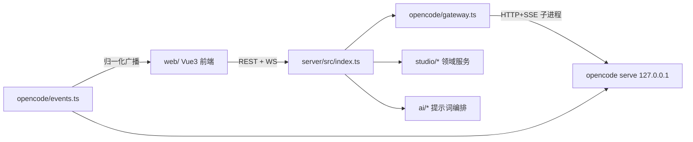

# UniBot Extension Studio

> 状态：核心闭环已上线运行（创建 → 规划 → 编码（AI 测试工具自测）→ 机械校验 → 一键发布），并有单文件可执行版发布流水线
> 本文档描述**当前实际实现**，是开发/维护本目录的唯一依据；历史规划细节见 Git 历史
> 前端编码规范：见「八、前端结构与编码规范」（原 `Frontend.md` 已并入）

## 一、定位

**Extension Studio** 是独立于 UniBot WebUI 的 AI 扩展开发平台：把 OpenCode Server 定制为
「开发 UniBot 原生扩展」的垂直场景，让不会写代码的用户用自然语言创建、检查并发布扩展。

- 独立部署、独立前后端，不嵌入 WebUi；通过发布接口把扩展交付到 UniBot `Extensions/<id>/`
- 后端是唯一可信边界：浏览器不直连 OpenCode、不接触其口令；AI 只能操作草稿工作区
- 结果导向：普通用户只接触功能摘要、使用方式与检查结果；源码/Diff/日志收在技术详情

不做：NoneBot 插件/渲染器市场发布、Git/PR 自动化、多人编辑同一草稿、浏览器保存模型密钥、进程级沙箱承诺、内嵌 WebUi。

## 二、生成流水线（实际编排）

```text
创建草稿 ──> planning(规划) ──idle──> coding(编码) ──idle──> 机械校验 ──> ready / draft+错误
             promptAsync(planning)     promptAsync(scaffold)    runValidation      │
                  ▲                                                    校验失败可 debug 修复┘
```

- **规划**：`POST /drafts` 创建脚手架 + OpenCode session，发送 planning 提示词（含用户需求、
  目标 MC 服务器快照、安全约束）；AI 可用 question 工具向用户提问
- **编码**：规划会话 idle 后事件层自动调 `startCoding()`——读取 `PLAN.md` 摘要存档，
  按 types 加载 skills，发送 scaffold 提示词；AI 在此阶段用测试工具部署/加载/自测扩展
- **机械校验**：编码会话 idle 后自动跑校验流水线（与手动 `POST /check` 一致）：
  通过 → `ready`（清除瞬时错误横幅）；失败 → 回 `draft` + 失败摘要，
  前端提供「让 AI 修复校验问题」（`POST /debug` 把失败步骤作为问题单喂回编码会话）、「重新校验」
- **状态机**：`draft → planning → coding → ready → published`，分支 `error`；
  `phase` 与 status 正交——abort/聊天会把 status 置回 draft 但保留 phase，
  用户继续时按 `inferResumeStatus()`（phase 缺失则按 PLAN.md 是否存在推断）恢复运行态。
  **状态先行**：发消息/进入阶段都先把草稿置为运行态再发提示词，保证 UI 与真实状态一致

### 会话结算（events.ts 核心职责）

opencode 在会话空闲时成对下发 `session.status{idle}` 与 `session.idle`：

- **闲置去重**：`draftId:sessionId` 键 2s 窗口只处理一次（避免双发导致流转执行两次）
- **结算节流**：60s 内已结算过的会话不再由协调循环重复触发（机械校验期间 status 仍停在
  coding，2s 轮询会重复看到「阶段状态 + idle」）
- **协调循环兜底**：每 2s 为新草稿建立按目录的 SSE 订阅、关闭已删草稿的订阅、清理去重标记；
  并对「停留在 planning/coding 但会话已空闲」的草稿主动结算
  （覆盖 SSE 断线间隙与后端重启后不重发 idle 的场景）
- **SSE 快速重订**：订阅意外断开时 500ms 内即重订，不等下一轮协调循环

## 三、稳定性要点（含「输出莫名停止」排查结论）

生成中输出突然停止的根因链（2026-08 排查，均有日志实证）：

1. **上游模型流式错误**（主因）：免费/共享网关模型间歇返回
   `AI_APICallError: Upstream request failed: Endpoint is unavailable.`，
   opencode 指数退避自动重试（2s/4s/8s…），重试耗尽则本轮终止
2. 平台侧放大器与对应修复（均已实现）：

| 放大器 | 修复 |
| --- | --- |
| 超时注入只覆盖固定 7 家 provider，漏掉实际使用的 `opencode` 网关 → 默认 chunkTimeout(~30s) 掐断长思考 | `syncTimeoutConfig` 遍历配置内全部 provider + 已知列表（含 `opencode`）注入 `timeout=900s / chunkTimeout=300s` |
| retry 事件细节被丢弃，界面静默卡住 | 归一化透传 `{attempt, message, next}`；前端工作台显示「正在自动重试」横幅；消息流渲染 RetryPart |
| 运行中 session.error 直接置 `status=error, phase=null` → 破坏 idle 结算判断，草稿卡死在异常 | 运行态下只记录错误文本保留状态/phase，等 idle 正常结算；busy/新消息/校验通过时清除错误 |
| WebSocket 无心跳，Bun.serve 默认 idleTimeout(10s) 在长静默期掐断连接 | 服务端 `idleTimeout: 120`；前端 20s 应用层心跳 ping |

其他稳定性行为：

- 后端重启恢复：中断的机械校验落盘为 failed（interrupted 步骤）；planning/coding 草稿由协调循环按会话真实状态结算，不会永久「运行中」
- abort 先把草稿置回 draft 再调 opencode（MessageAbortedError 不误判为阶段完成）；abort 失败回滚状态
- promptAsync 发送失败回滚运行态，避免草稿永久停留「进行中」
- 权限弹窗兜底：`GET /drafts/:id/permissions` 从 opencode 内存补拉待处理权限（SSE 丢事件也能弹出）
- 前端 store 全量拉取带请求序号守卫（乱序旧响应丢弃）；消息刷新合并防抖（200ms trailing，终态立即）

## 四、架构与文件结构



```text
server/src/
├── index.ts            # 入口：REST/WebSocket 路由、静态资源服务、启动与退出流程
├── paths.ts            # src 根锚点（资源定位基准，保持位于 src 根，勿移动）
├── core/               # 平台基础设施
│   ├── config.ts       # 配置加载/保存（env > config/studio.json > 默认）、白名单、脚本路径
│   ├── auth.ts         # HMAC token 签发/校验（密钥持久化）
│   ├── logger.ts       # 结构化日志（控制台配色 + 文件落盘轮转）
│   ├── disk.ts         # 磁盘空间检查
│   └── types.ts        # 共享类型（DraftMeta/StudioEvent/StudioConfig…）
├── opencode/           # OpenCode 集成
│   ├── gateway.ts      # serve 子进程生命周期、SDK 客户端、健康检查、插件同步、超时注入
│   ├── download.ts     # opencode 二进制自动下载（首次启动，~/.unibot-studio/opencode-bin/）
│   └── events.ts       # SSE 订阅/事件归一化/权限自动放行/会话结算/WS 广播
├── studio/             # 领域服务
│   ├── drafts.ts       # 草稿 CRUD、脚手架、路径安全解析、文件摘要(SHA-256)、git 初始化
│   ├── sessions.ts     # 会话↔草稿映射与活跃工作区注册表
│   ├── validation.ts   # 校验流水线编排（受限子进程调用 UniBot venv + 校验脚本）
│   ├── publishing.ts   # 原子发布（staging + rename，摘要核对，拒绝覆盖）
│   ├── test_tools.ts   # 测试工具后端实现（部署/移除/加载/日志/测试，只写测试环境）
│   ├── templates.ts    # 统一模板（Extension.Example GitHub 拉取缓存 + 示例代码清理）
│   ├── preview.ts      # 模板预览编排（Jinja2 渲染草稿 Templates → HTML）
│   ├── mc_server.ts    # 目标 MC 服务器选择/扫描（类型版本插件模组）/上下文渲染
│   └── unibot_env.ts   # 共享 UniBot 测试环境（GitHub release 下载 + uv venv）+ runProcess
└── ai/                 # AI 编排
    ├── pipeline.ts     # startCoding：安全约束 + skills + scaffold 提示词
    ├── prompts.ts      # 提示词模板版本化（server/prompts/*.md + versions 存储）
    ├── skills.ts       # 按扩展类型加载 server/skills/*.md 拼入 system
    ├── tools.ts        # 工具注册表（config/tools.json 持久化）
    └── registry.ts     # 功能开关模块注册表（features.json 语义）
```

数据目录 `~/.unibot-studio/`：`config/ drafts/ logs/ opencode/(隔离 XDG) opencode-bin/ resources/(单文件版解压) templates/ unibot/(测试环境)`。

安全边界不变：路径全部 `resolve()` + workspace 内校验、拒绝符号链接/越界/绝对路径；
权限默认拒绝，bash 的 `always` 在后端降级为 `once`；白名单文档/MC 服务器目录只读。

## 五、后端 API（实际路由）

统一 `{ code, data, message }` 包装；除登录外全部要求 Bearer token（WS 用 query token）。

| 方法 | 路径 | 用途 |
| --- | --- | --- |
| POST | `/auth/login` | 口令登录换 token |
| GET | `/status` | OpenCode/UniBot 目录/测试环境综合状态 |
| GET/PATCH | `/settings` | 平台设置（功能开关、UniBot 目录等） |
| GET/PATCH | `/tools` | 工具注册表 |
| GET/POST | `/prompts`、`/prompts/:name`、`/prompts/:name/activate` | 提示词版本管理 |
| GET/POST/DELETE | `/mc-server`、POST `/mc-server/pick` | 目标 MC 服务器设置/系统选窗/扫描 |
| GET | `/unibot-env`、POST `/unibot-env/sync` | 测试环境状态/后台同步 |
| POST | `/test/:action` | 测试工具回调：env/sync/deploy/undeploy/load/logs/run-tests/validate |
| GET/POST | `/templates`、GET `/templates/:id`、POST `/templates/:id/pull` | 开发模板 |
| GET/POST | `/drafts` | 列表/创建（并发限制：同时仅一个 planning/coding） |
| GET/DELETE | `/drafts/:id` | 详情/删除 |
| GET/POST | `/drafts/:id/messages` | 历史消息/发送提示词 |
| POST | `/drafts/:id/abort` · `/revert` · `/check` · `/debug` · `/publish` | 停止/回退/重新校验/AI 修复校验/发布 |
| GET | `/drafts/:id/files`、`/files/content?path=` | 文件树/内容（受限路径） |
| GET | `/drafts/:id/diff`、`/todo`、`/permissions` | 技术详情/待办/待处理权限兜底 |
| GET/POST | `/drafts/:id/preview` | 模板预览名列表/渲染 HTML |
| POST | `/drafts/:id/permissions/:pid`、`/questions/:qid`、`/questions/:qid/reject` | 权限回复/问题回答/忽略 |
| WS | `/api/studio/events` | 归一化实时事件推送 |

OpenCode 映射：session create/prompt_async/messages/abort/diff/todo/revert/status、
permission reply、question reply/reject（SDK 未生成的走底层 client post/get）、
`GET /event` 按工作区目录订阅 SSE、`GET /global/health` 直连健康检查。

### 事件契约（归一化后推给前端）

`session.status`(含 retry 细节) / `session.idle` / `session.error` / `message.updated` /
`message.part.updated` / `session.diff` / `todo.updated` / `permission.asked|replied|auto_granted` /
`question.asked|replied|rejected` / `draft.updated` / `draft.published` / `validation.updated` /
`unibot-env.updated`。断线重连后前端先 REST 全量恢复再消费实时事件。

## 六、校验、测试工具与提示词

### 校验流水线（server/validation/validate_extension.py，测试环境 venv 执行）

顺序执行，任一步失败阻止发布：路径与大小 → `Extension.toml` schema（id=目录名）→
Python 语法与 import 边界 → Ruff format+lint → pytest → Loader 发现绑定 → 依赖声明。
合成步骤：`env`（测试环境未就绪，引导同步环境）、`interrupted`（服务重启中断）。
同草稿并发锁防重复；通过时记录 `validation_revision`（全文件 SHA-256），发布前核对，过期锁定一键发布。

### 测试工具插件（server/plugins/unibot-tools.ts）

OpenCode 插件注册 8 个工具：`unibot_test_status / unibot_test_sync / unibot_deploy /
unibot_undeploy / unibot_load / unibot_logs / unibot_run_tests / unibot_validate`。
插件只转发参数到 Studio API `POST /api/studio/test/:action`（携带长效内部 token），
文件/子进程操作全部由后端执行并约束在测试环境 `<data>/unibot` 内。
开发模式由 gateway 启动前 Bun.build 打包；单文件版用 build.ts 预打包产物。

### 提示词与技能

- `server/prompts/`：`system.md`（角色+安全约束占位）、`planning.md`（规划）、`scaffold.md`（编码）、
  `summary.md`、`messages/status.md`（面向用户的阶段文案）、`docs/`（本地文档白名单副本，`bun run sync:docs` 同步）
- 安全约束由后端 `buildSecurity()` 追加（workspace 白名单、文档/市场白名单、MC 服务器只读、
  测试环境命令、联网规则），不进可编辑模板
- `server/skills/`：`api.md`、`command.md`，按草稿 types 自动拼入 system
- 版本化存储于 `<data_dir>/config/prompts/`，可激活/回滚

## 七、开发与打包

```bash
./Install.sh                     # 安装依赖（需 bun、opencode>=1.18、本机 UniBot）
cd server && bun src/index.ts    # 后端 :9876
cd web && bun run dev            # 前端 :9877（REST 代理到 9876，WS 直连）

cd server && bun test && bun run typecheck   # 测试与类型检查
bun release/build.ts             # 单文件可执行版（嵌入 prompts/skills/validation/plugins/web/dist）
```

- 登录口令首启自动生成，存 `config/studio.json`（`UNIBOT_STUDIO_PASSWORD` 可覆盖）；
  启动横幅打印带 token 的直接访问链接
- 单文件版：运行即解压资源到 `<data>/resources`（版本标记增量更新）、自动下载 opencode、
  端口占用自动改换、打印登录地址；CI 见 `.github/workflows/release.yml`
- 日志：控制台 + `<data>/logs/studio.log`（20MB 轮转），`UNIBOT_STUDIO_LOG_LEVEL=debug`
  可见 opencode 子进程输出与 SSE 事件明细（排查生成问题先开这个）

## 八、前端结构与编码规范

```text
web/src/
├── main.js / App.vue / router/index.js
├── views/          LoginView / DraftsView / WorkspaceView / AdminView
├── components/
│   ├── ui/         reka-ui 二次封装（Dialog/Tabs/Tree/ResizablePanel/Toast…），禁止直接用原始 reka-ui
│   └── studio/     业务组件（ConversationPanel/MessagePart/DraftFileTree/ResultSummary/
│                   ValidationPanel/TemplatePreview/PublishDialog/FileViewer/…）
├── composables/    use_studio_events.js（WS 连接+心跳+分发）、use_toast 等
├── stores/         studio.js（Pinia setup store：草稿/消息/文件/权限/问题/重试通知）
├── utils/          api.js（fetch 封装+WS 重连心跳）、opencode_parts.js、markdown.js…
└── styles/main.css # 设计变量（--bg/--accent/--radius/--space-* 等）
```

规范要点（沿用原 Frontend.md，完整版见 Git 历史或 WebUi/AGENT.md 同类章节）：

- 只用组合式 API `<script setup>`；块序 script→template→style scoped；props/emits 显式声明
- 响应式：对象/数组 reactive、单值 ref；副作用在 watch/watchEffect 并于 onUnmounted 清理
- Pinia 只用 Setup Store；组件 storeToRefs 解构 state/getter；状态只在 store 内改
- 命名：变量/函数 snake_case、组件 PascalCase、常量 UPPER_SNAKE、事件 kebab-case；
  禁止自造缩写；路径用 `@/` 别名
- 样式 scoped、CSS 变量、≤3 层嵌套、无 !important；圆角 6/8/10px、过渡 150–200ms
- 图标统一 `@iconify/vue` lucide 集，尺寸 16/20/24
- 大列表延迟渲染；parts 在 `utils/opencode_parts.js` 转稳定视图模型（text/reasoning/tool/
  step/subtask/retry/file 分块渲染）

## 九、已知限制与后续方向

- 渲染包/模板扩展的可视化预览已有（iframe srcdoc + Jinja2 渲染），专属可视化编辑仍属后续
- 免费网关模型上游不稳定：平台已做重试可见性与超时兜底，彻底解决需换更稳的 provider
- MC 真机测试环境（模式 A/B、mineflayer 机器人）为备用方案未实施；当前仅有目标服务器
  目录扫描 + 上下文注入（mc_server.ts）与 `features.mc_test_environment` 开关位
- 远程部署发布（UniBot REST API 交付）、Linux rootless 容器隔离、市场发布均未实施
