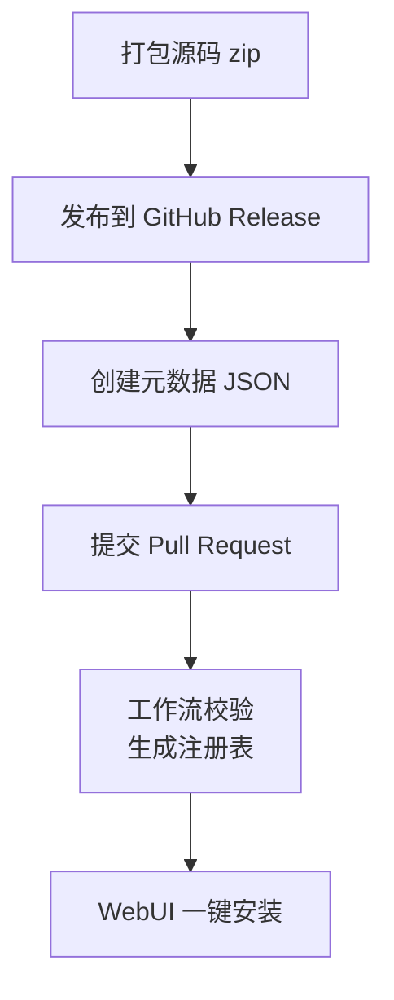

# 上传市场

扩展市场由 [UniBot.Market](https://github.com/MineJPGcraft/UniBot.Market) 仓库维护。
该仓库存放一份**由机器人自动读取的注册表** `extensions.json`，用户通过 **Pull Request**
提交自己的扩展，机器人即可在 WebUI 中搜索并一键安装。

## 整体流程

发布一个市场扩展分为三步：



::: steps

1. **打包扩展**

   把扩展源码压缩为 zip，确保**根目录包含 `Extension.toml`**，详见 [1. 打包扩展](#1-打包扩展)。

2. **发布 Release**

   将 zip 作为资产上传到扩展仓库的 GitHub Release，详见 [2. 发布 Release](#2-发布-release)。

3. **登记元数据**

   在市场的 `extensions/<id>.json` 中登记元数据并提交 PR，详见 [3. 创建元数据](#3-创建元数据)。

4. **合并入库**

   工作流校验通过并合并后，自动生成 `extensions.json`，机器人即可发现你的扩展。

:::

## 1. 打包扩展

> [!TIP]
> **推荐直接使用 [`Extensions/Example`](https://github.com/MineJPGcraft/Minecraft_UniBot/tree/main/Extensions/Example)
> 模板**：它已内置完整的打包工作流（`.github/workflows/release.yml`），Tag 推送后自动
> 打包为 zip 并发布到 GitHub Release，无需手动配置。在模板基础上开发自己的扩展即可。

扩展以源码 zip 形式分发（不走 PyPI），zip 根目录必须包含 `Extension.toml`。参考
[`Extensions/Example`](https://github.com/MineJPGcraft/Minecraft_UniBot/blob/main/Extensions/Example/.github/workflows/release.yml)
的打包工作流，zip 结构应为：

```file-tree
xxx-1.0.0.zip
├── Extension.toml      # 清单（必须位于根目录）
├── __init__.py         # 入口（代码型扩展必填）
├── Commands.py         # 指令定义（可选）
├── Services.py         # 服务定义（可选）
└── ...
```

> [!IMPORTANT]
> zip 根目录必须是扩展内容本身，**不能**再嵌套一层 `Extension/` 目录。否则 UniBot
> 解压后找不到根目录的 `Extension.toml`，安装会失败。

## 2. 发布 Release

将打包好的 zip 上传到扩展仓库的 GitHub Release，资产命名建议为 `<id>-<version>.zip`
（例如 `Placeholder-1.0.0.zip`），便于注册表脚本自动识别。

## 3. 创建元数据

在市场的 `extensions/` 目录下创建 `<扩展id>.json`（例如 `Example.json`）：

```json
{
  "id": "Example",
  "name": "示例扩展",
  "repo": "MineJPGcraft/Example",
  "description": "一个演示 UniBot 扩展开发流程的示例扩展。",
  "official": false
}
```

### 字段说明

::: table title="元数据字段" copy="all" hl-rows="tip:2,3"
| 字段 | 必填 | 说明 |
|------|------|------|
| `id` | 是 | 扩展唯一标识，须为字母数字下划线，必须与扩展包内 `Extension.toml` 的 `id` 一致 |
| `name` | 是 | 显示名称 |
| `repo` | 是 | 扩展源码仓库，格式 `owner/repo` |
| `description` | 否 | 扩展描述 |
| `official` | 否 | 是否官方发布（布尔值，默认 `false`），由仓库维护者审核设置，第三方扩展不可自行声明 |
:::

> [!NOTE]
> 元数据文件以下划线开头（如 `_EXAMPLE.json`）会被构建脚本跳过，作为文档模板使用。

## 4. 提交 PR

将新建的元数据文件提交到 [UniBot.Market](https://github.com/MineJPGcraft/UniBot.Market)
仓库并创建 Pull Request：

- 工作流会在 PR 上自动**校验元数据格式**，并到你的扩展仓库拉取 Release 验证可构建。
- 校验通过后由仓库维护者合并，`extensions.json` 会自动生成。

## SHA-256 安全机制

> **为什么不需要填写 sha256？**

SHA-256 校验和由市场仓库的**工作流在构建时实时计算**，用于防止下载被篡改。用户提交的
元数据中**不包含也不接受** `sha256` 字段，保证安全。WebUI 安装时会对下载的 zip 校验
注册表提供的 SHA-256，校验失败则拒绝安装。

## 自动更新

- **PR / push 时**：`build.yml` 重新构建注册表，并为每个扩展拉取最新 Release 资产，
  重新计算 SHA-256。
- **每天 9 点 / 15 点 / 21 点（北京时间）**：`update.yml` 自动检测各扩展仓库的新
  Release，更新版本号与 SHA-256 并提交回 `main`。

## 安装流程（WebUI 触发）

::: steps

1. **下载**

   从注册表选择版本，下载 Release 资产 zip。

2. **校验**

   校验注册表提供的 SHA-256 校验和。

3. **安全检查**

   校验 zip 根目录与清单中的 `id` 一致，拒绝绝对路径、`../` 路径与符号链接。

4. **原子替换**

   解压到临时目录，完成全部校验后原子替换 `Extensions/<id>/`。

5. **重启生效**

   重启后生效。

:::

安装是**可回滚事务**：下载、校验、解压与清单验证全部在临时目录完成，任一步失败都不得
改变当前版本。升级即下载新版本后原子替换目录；卸载即删除目录（均在 WebUI 操作）。

## 本地构建（可选）

无需 GitHub Token 即可对已有 Release 构建（公用 API 有速率限制），需 Python 3.11+：

```bash
python3 scripts/build_registry.py
```

严格校验模式（等价于 PR 检查）：

```bash
python3 scripts/build_registry.py --validate
```
