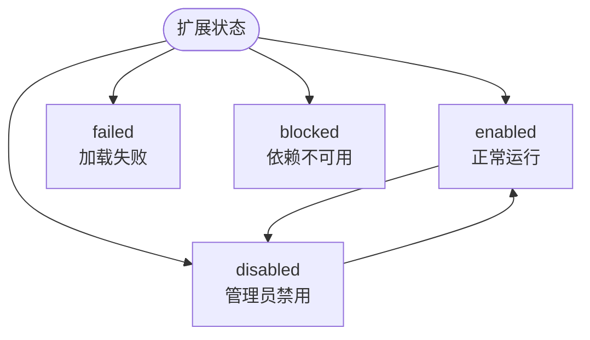

# 扩展系统

UniBot 基于 [NoneBot2](https://nonebot.dev/) 生态构建，可**无缝接入 NB 插件商店**，社区现成的 NoneBot 插件开箱即用。与此同时，UniBot 在 NoneBot 插件体系之外，还提供了一套**原生扩展系统**，用于承载与机器人内部能力深度绑定的功能。

扩展是机器人功能的独立单元，可以完整访问机器人的内部能力（配置、管理器、渲染与消息工具），并与核心功能严格隔离、按需启停。

## 设计理念

扩展系统遵循以下原则：

- **生态兼容**：底层完全基于 NoneBot2，NB 插件商店的插件可无缝接入，与原生扩展协同工作。
- **能力分层**：扩展按职责分为指令、服务、渲染器、模板与资源五类，各司其职，避免职责混杂。
- **声明式注册**：扩展通过清单与声明式注册描述自身能力，由框架统一发现、校验与装配，无需关心注册细节。
- **失败隔离**：单个扩展加载失败不影响机器人整体运行，失败原因会明确记录并可追溯。
- **权限收敛**：代码型扩展与机器人同进程运行，属于可信代码；资源型扩展不执行任何代码，仅提供静态内容。

## 扩展类型

扩展分为三类代码型与两类资源型：

::: table title="扩展类型一览" copy="all"
| 类型 | 是否含代码 | 职责 | 典型用途 |
|------|-----------|------|---------|
| **指令扩展**（`command`） | 是 | 新增聊天指令，或覆盖内置指令行为 | 查询、统计、自定义玩法指令 |
| **API 扩展**（`api`） | 是 | 为其它扩展或整个系统提供可复用的服务能力 | 天气查询、权限校验、数据服务 |
| **渲染器扩展**（`renderer`） | 是 | 将已生成的页面渲染为图片 | html2pic、Playwright、wkhtmltoimage |
| **模板扩展**（`template`） | 否 | 提供页面模板，并声明资源依赖 | 列表、状态卡片的版式与配色 |
| **资源扩展**（`resources`） | 否 | 提供图片、字体、样式片段等静态文件 | 背景图、字体、调色板 |
:::

> **关于组合**：五种类型可自由组合在同一个扩展中——代码能力（`command`/`api`/`renderer`）与无代码类型（`template`/`resources`）混用时，扩展既有 `__init__.py` 入口参与正常加载，其模板与资源部分也会被静态注册；仅声明无代码类型的扩展包则无需入口文件。声明 `renderer` 时必须在 `[renderer]` 段提供 `name`。

## 扩展包形态

扩展以三种形态存在，加载方式完全一致：

::: table title="扩展包形态" copy="all"
| 形态 | 说明 | 元数据来源 |
|------|------|-----------|
| **单文件扩展** | 适合简单指令，一个文件即可 | 扩展实例的构造参数 |
| **目录型扩展** | 多模块、含配置与依赖的完整扩展 | `Extension.toml` 清单 |
| **市场扩展** | 从 GitHub Release 下载的源码包 | `Extension.toml` 清单 |
:::

所有扩展统一存放在 `Extensions/` 目录下，Loader 不区分本地扩展与市场扩展。

### 目录结构

```file-tree
Extensions/
├── Hello.py                # 单文件扩展（可选）
├── WeatherExt/             # 目录型扩展（可选）
│   ├── Extension.toml      # 清单（必填）
│   ├── __init__.py         # 入口（代码型扩展必填）
│   ├── Commands.py         # 指令定义（可选）
│   ├── Services.py         # 服务定义（可选）
│   └── ...                 # 其它模块
└── Default/                # 无代码模板 + 资源组合包
    ├── Extension.toml
    ├── Templates/          # 模板根目录
    └── Resources/          # 资源根目录
```

命名约定：

- 扩展统一使用 PascalCase 命名，如 `WeatherExt`。
- 目录型扩展的目录名与 `extension.id` 必须完全一致（含大小写）。
- 代码型扩展的入口固定为 `__init__.py`；纯无代码扩展不需要入口文件（混合扩展因含代码能力，同样需要入口）。

## 清单（`Extension.toml`）

目录型扩展通过清单声明身份、兼容性、依赖与类型信息。清单由框架严格校验，未知字段、非法类型或无效版本约束都会直接阻止加载。

```toml
[manifest]
schema_version = 1               # 清单格式版本

[extension]
id = "WeatherExt"                # 唯一标识，PascalCase，与目录名一致
name = "示例扩展"                 # 显示名称
version = "1.0.0"
author = "xxx"
description = "扩展描述"
types = ["api"]                  # api | command | renderer | template | resources

[compatibility]
unibot = ">=0.0.5"               # 兼容的机器人版本

[dependencies]
extensions = ["OtherExt"]        # 依赖的其它扩展 id，决定加载顺序
python = []                      # 第三方 Python 依赖

[renderer]                       # 仅渲染器扩展需要
name = "html2pic"                # 渲染器名称

[template]                       # 仅模板扩展需要
entry = "Templates"              # 模板根目录（相对扩展包根目录）
resources = []                   # 可选资源扩展 id

[resources]                      # 仅资源扩展需要
root = "Resources"               # 资源根目录（相对扩展包根目录）
```

### 模板配置声明

无代码模板可以在清单中声明受限的配置字段，用于定制模板外观。第一版支持 `string`、`integer`、`number`、`boolean`、`color`、`select` 六种类型，每项必须提供类型与默认值：

```toml
[template.config_schema.primary_color]
type = "color"
default = "#2f80ed"
title = "主色"

[template.config_schema.compact]
type = "boolean"
default = false
title = "紧凑布局"

[template.config_schema.font]
type = "select"
default = "default"
options = ["default", "serif", "mono"]
title = "字体"
```

- 字段名必须是合法标识符且不能以下划线开头。
- `select` 必须提供非空的 `options`，且默认值必须包含在其中。
- `title`、`description`、数值 `min`/`max`、字符串 `min_length`/`max_length` 为可选的展示或约束信息。

## 配置与数据目录

扩展的配置与数据与核心配置严格分离，各归其位：

::: table title="配置与数据目录" copy="all"
| 数据 | 位置 | 维护者 | 内容 |
|------|------|--------|------|
| 扩展启停 | `Config/Extensions.toml` | 用户 / WebUI | 每个扩展的 `enabled` 启停标志 |
| 扩展配置 | `Config/Extensions/<id>.toml` | 用户 / WebUI | 经过校验的业务配置 |
| 管理状态 | `Data/Extension/States.toml` | 框架 | 来源、版本、校验和、安装时间、依赖归属 |
| 业务数据 | `Data/Exs/<id>/` | 扩展数据工具 | 缓存、数据库、生成文件 |
:::

```toml
# Config/Extensions.toml —— 用户可直接编辑启停
[WeatherExt]
enabled = true
```

```toml
# Config/Extensions/WeatherExt.toml —— 扩展业务配置
api_key = "xxx"
city = "Shanghai"
```

设计约定：

- `Config.toml` 只保存 UniBot 核心配置，扩展不得直接读写它。
- 扩展配置与数据均限定在自身目录内，越界访问会被框架拒绝。
- 升级或卸载源码时默认保留扩展配置与业务数据；彻底删除需管理员单独确认。
- 配置写入采用原子替换，校验或写盘失败时保留旧文件。

## 扩展状态

扩展的运行状态由框架统一管理，状态含义明确：

::: table title="扩展状态" copy="all"
| 状态 | 含义 |
|------|------|
| `enabled` | 正常运行 |
| `disabled` | 管理员主动禁用，重启后仍然保留 |
| `blocked` | 依赖方被禁用或加载失败，当前不可用 |
| `failed` | 扩展自身加载或生命周期失败 |
:::



- 主动禁用的扩展不导入、不注册任何能力；其直接或间接依赖方会标记为 `blocked`，无关扩展不受影响。
- 禁用不会删除扩展源码、配置或数据；重新启用时这些内容继续使用。
- `disabled` 会持久化为管理员的主动选择；`failed` 与 `blocked` 在下一次加载时重新计算。
- ==当前版本的启用 / 禁用操作均为重启生效。==

## 渲染系统

渲染系统由三个正交层次构成，职责互不重叠：

| 层次 | 职责 | 示例 |
|------|------|------|
| **渲染引擎**（`renderer`） | 将已生成的页面渲染为图片 | html2pic、Playwright |
| **模板**（`template`） | 提供页面版式，声明资源依赖 | 列表模板、状态卡片模板 |
| **资源**（`resources`） | 提供图片、字体、样式等静态文件 | 背景图、字体、调色板 |

- 渲染引擎可以独立使用；模板必须至少有一个模板目录；资源可以被多个模板复用。
- 同一渲染任务中，模板决定外观、资源提供素材、渲染引擎负责成图，三者通过框架协调完成。
- 模板只允许从自身声明的目录加载文件，禁止越界访问。
- 多个模板包按显式优先级组成查找链：当前选择的模板优先，默认模板作为最终回退。

### 渲染配置

渲染能力在 `Config.toml` 中配置：

```toml
[image]
mode = true
renderer = "html2pic"        # 渲染引擎
template = "Default"         # 模板包
```

- 模板切换即时生效，无需重启。
- 渲染引擎切换需重启生效；配置的引擎不存在或未选择时，渲染会报错提示。
- 资源扩展由模板的 `resources` 显式依赖决定，缺失或越界时对应模板会标记为不可用。

## 加载与依赖管理

### 加载时序

机器人在完成核心初始化后按以下顺序加载扩展：

1. 扫描 `Extensions/` 目录，识别单文件与目录型扩展。
2. 解析清单与元数据，统一校验标识、类型、版本约束与兼容性。
3. 建立依赖图并进行拓扑排序，检测缺失依赖与循环依赖。
4. 导入代码型扩展入口，获取唯一扩展实例并完成绑定。
5. 提交指令、服务与渲染器声明，注册模板与资源。
6. 按拓扑顺序执行生命周期方法，启动外部资源。

任一扩展失败默认不阻止机器人启动，但该扩展及其依赖方会标记为不可用，并向日志与 WebUI 提供错误原因。

### 依赖规则

- 扩展通过 `[dependencies].extensions` 声明对其它扩展的依赖，被依赖方先于依赖方启动。
- 扩展声明的第三方 Python 依赖由框架聚合后统一安装，卸载时仅在无其它扩展使用时移除。
- 循环依赖会被检测并阻止相关扩展加载。

## 热重载

无需重启机器人即可让代码改动生效，覆盖指令、服务、渲染器与模板/资源等全部扩展类型：

| 方式 | 触发点 | 说明 |
|------|--------|------|
| 手动指令 | `.bot reload`（超级用户） | 全量热重载 |
| WebUI | 扩展页「重载」按钮 | 全量热重载 |
| 自动监听 | `Extensions/` 目录文件变更 | 启动命令加 `--reload` 参数开启 |

### 工作流程

1. 语法预检：任一文件存在语法错误时直接中止，旧扩展不受影响。
2. 快照当前状态，停用旧扩展并注销命令 matcher。
3. 清理模块缓存（`sys.modules` 与 `__pycache__`），重新发现并加载全部扩展。
4. 重建命令 matcher 并按拓扑顺序重新启用。

**失败回滚**：第 2 步之后任何环节失败（依赖缺失、命令校验失败、启用异常等），
框架会自动恢复快照中的旧扩展并重新启用，保证机器人始终可用；错误信息会带回滚说明。

### 自动监听

启动时追加 `--reload` 参数开启，两种入口均可：

```bash
uv run Bot.py --reload        # 直接启动机器人
uv run Watchdog.py --reload   # 守护模式（参数会透传给 Bot 子进程）
```

监听的轮询参数可在 `Config.toml` 中调整：

```toml
[hot_reload]
interval = 3.0    # 轮询间隔（秒）
debounce = 1.0    # 静默期（秒）：签名连续两次扫描一致才触发，避免编辑器分片写入引发连续重载
```

- 监听范围是 `Extensions/` 下所有文件的增删改（代码、清单、模板、资源）；内置扩展随框架更新重启生效，不在监听范围内。
- 开启后从市场安装的扩展也会在安装完成后自动生效，无需手动重载或重启。
- 重载失败（如保存了有语法错误的代码）时旧扩展保持可用，修复文件后会自动再次重载。

## WebUI 管理

WebUI 提供完整的扩展管理能力（需管理员权限）：

| 功能 | 说明 |
|------|------|
| 扩展列表 | 查看已安装扩展的类型、版本、依赖与启停状态 |
| 启用 / 禁用 | 持久化启停意图，重启后生效 |
| 配置管理 | 按清单 / 模型生成的表单可视化编辑扩展配置 |
| 渲染设置 | 分别选择当前渲染引擎与模板，模板切换即时生效 |
| 扩展市场 | 浏览、安装与卸载市场扩展（后续版本） |

## 更多

- 面向开发者的完整指南，请参阅 [开发插件](/unibot/developing-extensions.html)。
- 扩展相关的 WebUI 接口，请参阅 [REST API](/unibot/api-reference.html)。
